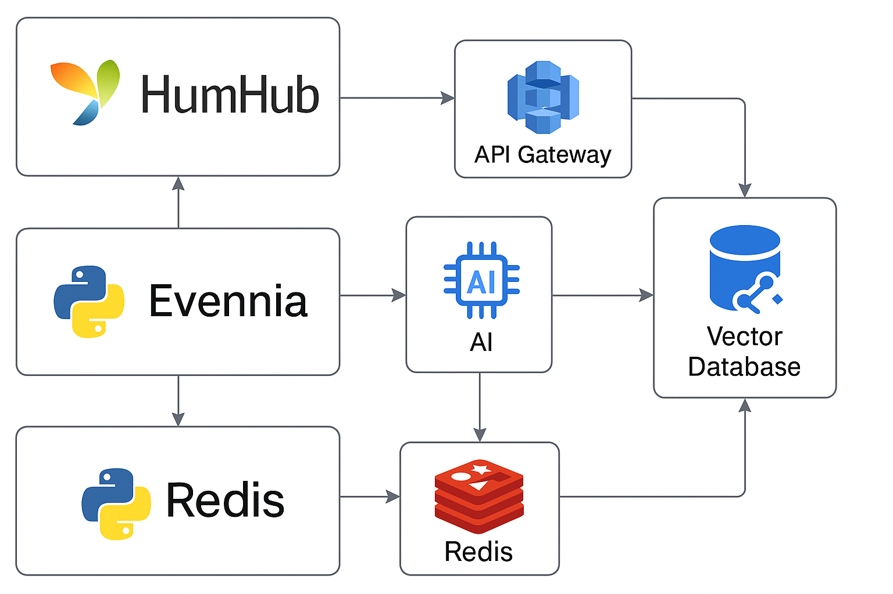

# 2. Integration of HumHub (Yii) with Evennia (Python) and AI Components

## Context
We are building a hybrid platform that combines:
- **HumHub (Yii/PHP)** for social networking and community features.
- **Evennia (Python)** for multiplayer RPG game logic.
- **AI Layer** for dynamic NPC interactions and content generation.
- **Redis** for caching and lightweight message queuing.
- **Vector Database** for semantic search and retrieval-augmented generation (RAG).

The goal is to enable seamless interaction between the social hub and the game engine while supporting AI-driven features.

## Decision
We will:
- Use **HumHub** as the primary user interface and identity provider.
- Deploy **Evennia** as a separate Python microservice for game logic.
- Implement **SSO** using OAuth2/JWT between HumHub and Evennia.
- Use **Azure API Management (APIM)** as the API gateway for secure communication.
- Integrate **Redis** for caching AI inference results and managing lightweight queues.
- Use a **Vector Database** (e.g., Qdrant or Azure Cosmos DB with vector search) for semantic search.
- Deploy services on **Azure App Service** (HumHub), **Azure Container Apps or AKS** (Evennia and AI), and **Azure Cache for Redis**.
- Store AI models and game assets in **Azure Blob Storage**.

## Alternatives Considered
- **Single monolithic app**: Rejected due to complexity and lack of scalability.
- **Rails or React front-end**: Rejected to avoid unnecessary complexity.
- **Rust for AI inference**: Rejected; Python ecosystem is sufficient for current needs.

## Consequences
- **Positive**:
  - Clear separation of concerns between social and game logic.
  - Scalable architecture using microservices.
  - Easy integration of AI and caching layers.
- **Negative**:
  - Requires API gateway and SSO implementation.
  - Increased operational complexity compared to a monolithic design.

## Diagram
